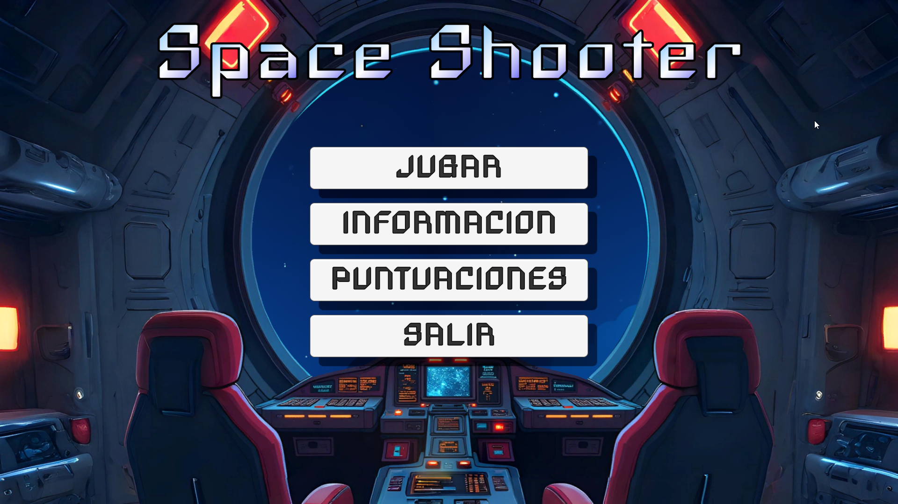
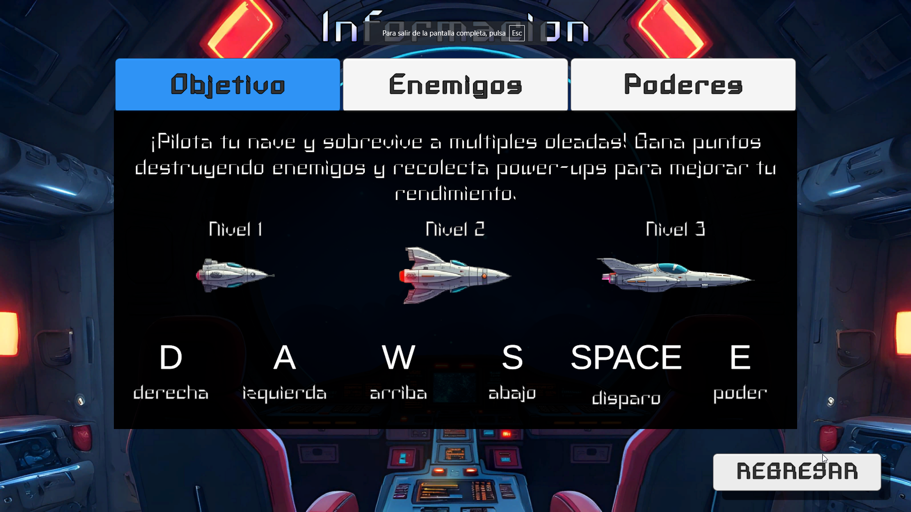
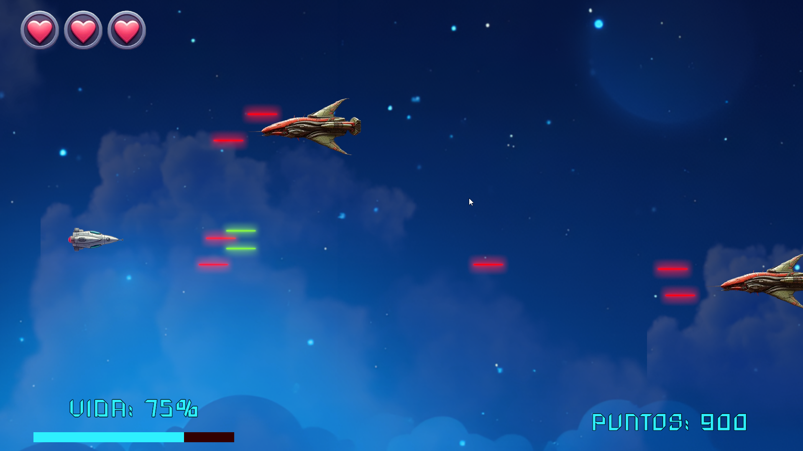

# 🚀 Space Shooter - Proyecto de Videojuego en Unity

**Space Shooter** es un videojuego 2D desarrollado en Unity como parte del máster en Diseño y Desarrollo de Videojuegos (UNIR). El jugador controla una nave en un entorno galáctico, enfrenta oleadas de enemigos y recolecta ítems con poderes únicos mientras intenta alcanzar la mayor puntuación posible.

---

## 🎮 Características principales

- 🕹️ Controles adaptados para teclado y dispositivos móviles
- ⚔️ Enemigos con distintos niveles de dificultad y comportamiento
- 📦 Sistema de ítems con poderes especiales:
  - Vida extra
  - Escudo temporal (pendiente)
  - Disparo potenciado (pendiente)
  - Precisión máxima (pendiente)
- 📊 Guardado de puntuación con nombre y fecha
- 🧠 Sistema de dificultad seleccionable (Fácil, Moderado, Difícil)
- 📝 El jugador **ingresa su nombre y selecciona la dificultad antes de iniciar la partida**
- 📱 UI optimizada para pantallas pequeñas
- 💾 Guardado persistente en formato JSON
- 🌌 Música y efectos generados con IA (Suno y Flux)

---

## 📷 Capturas

---

## 📋 Controles

| Acción       | PC           | Móvil               |
|--------------|--------------|---------------------|
| Mover nave   | WASD         | Botones táctiles    |
| Disparar     | Espacio      | Botón disparo       |
| Pausar/salir | Esc          | Botón menú          |

---

## 📂 Estructura del proyecto

- `Assets/Scripts` – Lógica del juego (jugador, enemigos, UI, guardado)
- `Assets/Prefabs` – Prefabs de enemigos, ítems y disparos
- `Assets/Scenes` – Menú, inicio de partida, juego, pantalla final
- `Assets/Resources/JSON` – Puntuaciones guardadas

---

## 💾 Guardado de partidas

Al iniciar la partida, el jugador **ingresa su nombre** y selecciona la **dificultad**.  
Al finalizar, su puntaje se guarda en un archivo local (`partidas.json`) con su nombre y fecha.

---

## 🛠️ Tecnologías usadas

- Unity 2022+
- C#
- TMP (TextMeshPro)
- JSON (serialización)
- Herramientas de IA: 
  - **Suno** (música original)
  - **FLUX.1 [dev]** (assets visuales, licencia no comercial)

---

## 📄 Licencia de uso

Este proyecto fue desarrollado con fines académicos.  
Los assets generados por IA se utilizan bajo licencias no comerciales.  
No se autoriza la redistribución ni reutilización del código o recursos con fines comerciales sin autorización previa.

---

## 🧠 Autor

**Alex López (Frobenyus)**  
Desarrollador y estudiante del máster en Videojuegos - UNIR  
GitHub: [@AlexRose97](https://github.com/AlexRose97)  
Itch.io: [frobenyus.itch.io](https://frobenyus.itch.io)

---

## 📌 Estado actual

✅ Juego funcional  
🔄 Próximas mejoras posibles:
- Escudo temporal (pendiente)
- Disparo potenciado (pendiente)
- Precisión máxima (pendiente)
- Nuevos enemigos y animaciones
- Modos de juego por tiempo o supervivencia

---
